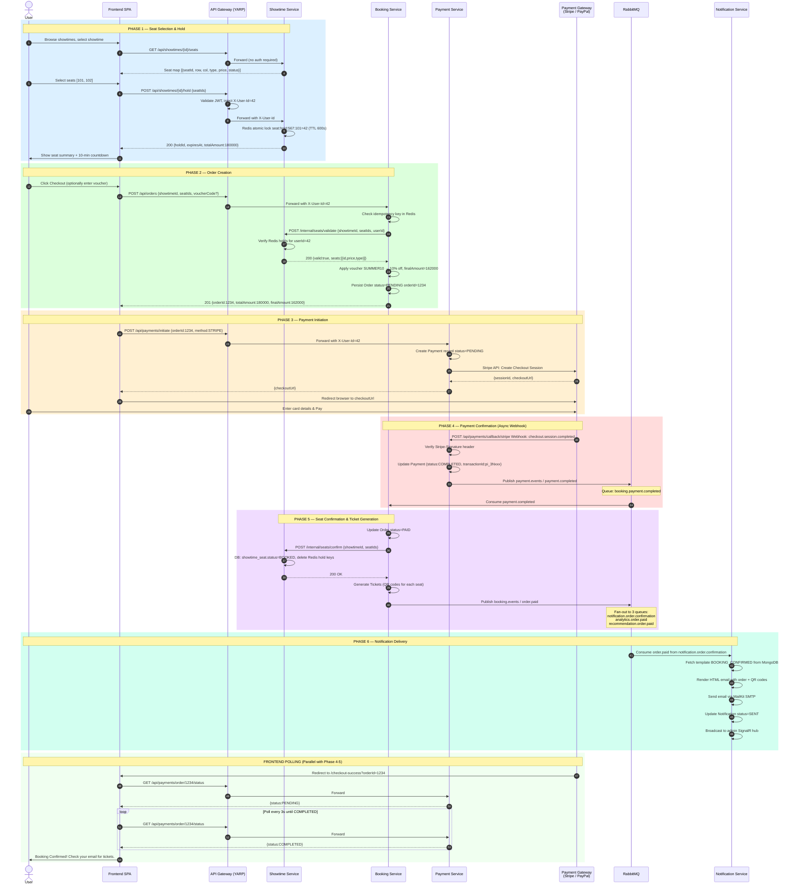
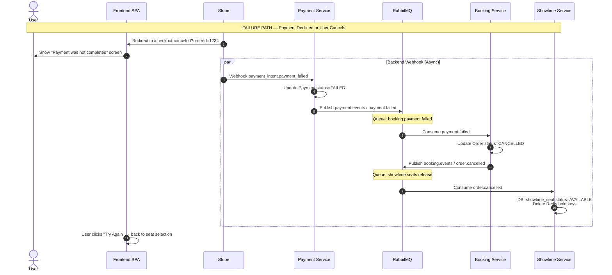
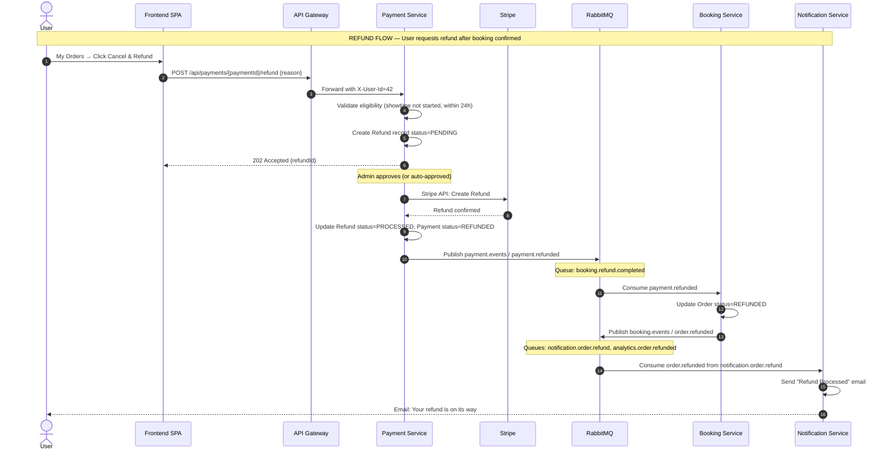

# Booking Saga — Full End-to-End Flow

> **Pattern**: Choreography-based Saga (event-driven, no central orchestrator)  
> **Date**: 2026-07-31  
> **Services Involved**: Frontend SPA · API Gateway (YARP) · Showtime Service · Booking Service · Payment Service · Notification Service  
> **Message Broker**: RabbitMQ 3.13 (topic exchanges)

---

## Table of Contents

1. [Overview](#1-overview)
2. [Actors & Services](#2-actors--services)
3. [Phase 1 — Seat Selection & Hold](#3-phase-1--seat-selection--hold)
4. [Phase 2 — Order Creation](#4-phase-2--order-creation)
5. [Phase 3 — Payment Initiation](#5-phase-3--payment-initiation)
6. [Phase 4 — Payment Confirmation (Webhook / Callback)](#6-phase-4--payment-confirmation-webhook--callback)
7. [Phase 5 — Seat Confirmation & Ticket Generation](#7-phase-5--seat-confirmation--ticket-generation)
8. [Phase 6 — Notification Delivery](#8-phase-6--notification-delivery)
9. [Happy Path Sequence Diagram](#9-happy-path-sequence-diagram)
10. [Failure & Compensation Flow](#10-failure--compensation-flow)
11. [Message Reference — All Routing Keys & Queues](#11-message-reference--all-routing-keys--queues)
12. [State Transition Tables](#12-state-transition-tables)
13. [Idempotency Strategy](#13-idempotency-strategy)
14. [Observability & Tracing](#14-observability--tracing)

---

## 1. Overview

The **Booking Saga** is the most complex cross-service transaction in the Cinema Booking System. It coordinates four microservices across a distributed environment — **no single service owns the full transaction**. Instead, each service reacts to events published by the previous step, forming a chain of reactions.

```
Frontend → API Gateway → Showtime Service (seat hold)
                       → Booking Service (create order)
                       → Payment Service (charge user)
                       → Booking Service (mark paid, generate tickets)
                       → Showtime Service (confirm seats BOOKED)
                       → Notification Service (send email/push)
```

**Saga Type**: **Choreography** — each service listens to events and decides what to do next. There is no central saga orchestrator. Compensation (rollback) is triggered by failure events propagated back through RabbitMQ.

---

## 2. Actors & Services

| Actor / Service | Technology | Port | Role in Saga |
|---|---|---|---|
| **User (browser)** | React SPA | — | Initiates booking, enters payment details |
| **API Gateway** | ASP.NET YARP | 5000 | JWT validation, request routing, X-User-Id injection |
| **Showtime Service** | Spring Boot (Java 21) | 8082 | Seat hold (Redis TTL), seat confirmation, seat release |
| **Booking Service** | Spring Boot (Java 21) | 8083 | Order lifecycle, ticket generation, voucher validation |
| **Payment Service** | ASP.NET Core 9 (C#) | 5003 | Payment initiation, gateway callback, refund |
| **Notification Service** | ASP.NET Core 9 (C#) | 5004 | Email/SMS delivery on booking events |
| **RabbitMQ** | RabbitMQ 3.13 | 5672 | Async message broker for all saga events |
| **Redis** | Redis 7 | 6379 | Seat hold TTL locks, idempotency keys |
| **Stripe / PayPal** | External gateway | — | Payment processing |

---

## 3. Phase 1 — Seat Selection & Hold

**Goal**: The user selects seats for a showtime. Seats are temporarily locked for the user (TTL = 10 minutes) so no other user can book them during checkout.

### Steps

| # | Actor | Action | Details |
|---|---|---|---|
| 1 | User | Opens seat map | Clicks on an available showtime on the frontend |
| 2 | Frontend | `GET /api/showtimes/{id}/seats` | Fetches real-time seat availability from Showtime Service |
| 3 | Showtime Service | Returns seat map | Each seat includes `id`, `row`, `column`, `type`, `price`, `status` (AVAILABLE / HELD / BOOKED) |
| 4 | User | Selects seats | Clicks on 1–8 available seats |
| 5 | Frontend | `POST /api/showtimes/{id}/hold` | Sends `{ seatIds: [101, 102, 103] }` with Bearer token |
| 6 | API Gateway | JWT validation | Validates Keycloak JWT, resolves Keycloak UUID → internal Long `userId` via User Profile Service cache. Injects `X-User-Id`, `X-Keycloak-Id`, `X-User-Roles` headers |
| 7 | Showtime Service | Hold seats in Redis | For each seat: sets key `seat:hold:{showtimeId}:{seatId}` = `{userId}` with TTL = 600s (10 min). Atomically checks no other user holds them |
| 8 | Showtime Service | Returns hold confirmation | `{ holdId, seatIds, expiresAt, totalAmount }` |
| 9 | Frontend | Starts countdown timer | Displays "Seats held for 9:59..." countdown to the user |

### Seat Hold Redis Key Schema

```
seat:hold:{showtimeId}:{seatId}  →  value: {userId}   TTL: 600s
```

> **Concurrent access**: Seat hold uses a Lua script for atomic check-and-set in Redis, preventing race conditions when two users try to hold the same seat simultaneously.

---

## 4. Phase 2 — Order Creation

**Goal**: Create a pending Order in the Booking Service, validating that held seats belong to the requesting user. Voucher discounts are applied at this step.

### Steps

| # | Actor | Action | Details |
|---|---|---|---|
| 10 | User | Clicks "Checkout" | On the seat confirmation screen |
| 11 | Frontend | `POST /api/orders` | Body: `{ showtimeId, seatIds, voucherCode? }` |
| 12 | API Gateway | Routes to Booking Service | Requires `Authorization: Bearer <JWT>` |
| 13 | Booking Service | Validate idempotency key | Checks Redis key `order:idem:{userId}:{showtimeId}:{sortedSeatIds}` (TTL 5 min) — rejects duplicate requests |
| 14 | Booking Service | `POST /internal/seats/validate` → Showtime Service | Validates that all `seatIds` have a Redis hold owned by `userId`. Internal sync HTTP call (with `X-Internal-Api-Key` header) |
| 15 | Showtime Service | Returns seat validation result | Returns `{ valid: true, seats: [{id, price, type}] }` or 409 Conflict |
| 16 | Booking Service | Apply voucher (optional) | If `voucherCode` provided: validates voucher (active, not expired, usage limit), calculates discount. Returns 400 if invalid |
| 17 | Booking Service | Persist Order | Creates `Order` record: `status=PENDING`, `totalAmount`, `finalAmount`, `userId`, `showtimeId`, `voucherApplied` |
| 18 | Booking Service | Returns `201 Created` | `{ orderId, totalAmount, finalAmount, status: "PENDING" }` |

### Internal API Call (Sync)

```
POST http://showtime-service:8082/internal/seats/validate
Headers: X-Internal-Api-Key: <secret>
Body: { "showtimeId": 567, "seatIds": [101, 102], "userId": 42 }
```

---

## 5. Phase 3 — Payment Initiation

**Goal**: The frontend sends the user to the payment gateway. Three supported methods: Stripe (hosted checkout), PayPal (redirect flow), Cash (counter, admin-confirmed).

### Steps

| # | Actor | Action | Details |
|---|---|---|---|
| 19 | Frontend | `POST /api/payments/initiate` | Body: `{ orderId, paymentMethod: "STRIPE" }` |
| 20 | API Gateway | Routes to Payment Service | Injects `X-User-Id`, `X-User-Roles` |
| 21 | Payment Service | Creates Payment record | `status=PENDING`, `orderId`, `userId`, `amount` |
| 22a *(Stripe)* | Payment Service | Stripe API: Create Checkout Session | `POST https://api.stripe.com/v1/checkout/sessions` with `metadata.orderId`, `success_url=/checkout-success?orderId={orderId}`, `cancel_url=/checkout-canceled` |
| 22b *(PayPal)* | Payment Service | PayPal API: Create Order | `POST https://api.sandbox.paypal.com/v2/checkout/orders` with `return_url`, `cancel_url` |
| 22c *(Cash)* | Payment Service | No gateway call | Creates payment record with `status=PENDING, method=CASH`. Staff manually confirms at counter later |
| 23 | Payment Service | Returns `{ checkoutUrl }` | For Stripe/PayPal: the gateway's hosted payment URL. For Cash: `{ status: "AWAITING_CASH" }` |
| 24 | Frontend | Redirects user to `checkoutUrl` | Browser leaves the SPA and opens the gateway's secure hosted checkout page |

### Stripe Session Creation

```json
POST https://api.stripe.com/v1/checkout/sessions
{
  "payment_method_types": ["card"],
  "line_items": [{ "price_data": {...}, "quantity": 1 }],
  "mode": "payment",
  "success_url": "https://app.cinema.com/checkout-success?orderId=1234",
  "cancel_url": "https://app.cinema.com/checkout-canceled?orderId=1234",
  "metadata": { "orderId": "1234", "userId": "42" }
}
```

---

## 6. Phase 4 — Payment Confirmation (Webhook / Callback)

**Goal**: The external payment gateway notifies the Payment Service of the outcome. This triggers the core saga choreography via RabbitMQ.

### Stripe Webhook Path

| # | Actor | Action | Details |
|---|---|---|---|
| 25 | Stripe | `POST /api/payments/callback/stripe` | Fires `checkout.session.completed` or `payment_intent.payment_failed` webhook to Payment Service |
| 26 | Payment Service | Verify webhook signature | Validates `Stripe-Signature` header using `STRIPE_WEBHOOK_SECRET`. Rejects tampered requests |
| 27 | Payment Service | Update Payment record | Sets `status=COMPLETED`, `paidAt=now()`, `transactionId=pi_xxx`, logs to `transaction_logs` |
| 28 | Payment Service | Publish `payment.completed` | Exchange: `payment.events`, routing key: **`payment.completed`** |

### PayPal Redirect Path

| # | Actor | Action | Details |
|---|---|---|---|
| 25 | PayPal | `GET /api/payments/callback/paypal/return?token=ORDER_ID` | Redirects user's browser back to Payment Service |
| 26 | Payment Service | Capture PayPal Order | Calls `POST https://api.paypal.com/v2/checkout/orders/{token}/capture` |
| 27 | Payment Service | Update Payment record | `status=COMPLETED`, `transactionId=capture_id` |
| 28 | Payment Service | Publish `payment.completed` | Exchange: `payment.events`, routing key: **`payment.completed`** |

### Frontend Polling (Parallel)

While the webhook processes on the backend, the user is redirected to `/checkout-success`:

```
Frontend polls GET /api/payments/order/{orderId}/status every 3s
→ Returns PENDING (webhook not yet processed)
→ Returns COMPLETED (webhook processed)
→ Frontend shows "Booking Confirmed!" screen
```

---

## 7. Phase 5 — Seat Confirmation & Ticket Generation

**Goal**: Once payment is confirmed, the Booking Service marks the order PAID, confirms seats as permanently BOOKED, and generates tickets.

### Steps (Triggered by `payment.completed` event)

| # | Consumer | Action | Details |
|---|---|---|---|
| 29 | **Booking Service** | Consumes `payment.completed` | Queue: `booking.payment.completed` |
| 30 | Booking Service | Update Order status | `Order.status` → `PAID`, records `transactionId` |
| 31 | Booking Service | `POST /internal/seats/confirm` → Showtime Service | Confirms seats HELD → BOOKED permanently. Sync HTTP call |
| 32 | Showtime Service | Confirm seats in DB | Updates `showtime_seat.status = BOOKED` for each seatId. Removes Redis hold keys |
| 33 | Showtime Service | Returns `200 OK` | Confirmation of all seats updated |
| 34 | Booking Service | Generate Tickets | Creates `Ticket` records: one per seat, with `qrCode`, `orderId`, `seatId`, `showtime` data |
| 35 | Booking Service | Publish `order.paid` | Exchange: `booking.events`, routing key: **`order.paid`** |

### `order.paid` Payload

```json
{
  "eventId": "uuid-v4",
  "eventType": "order.paid",
  "timestamp": "2026-07-31T10:00:00Z",
  "payload": {
    "orderId": 1234,
    "userId": 42,
    "showtimeId": 567,
    "movieId": 15,
    "movieTitle": "Inception",
    "showtimeStartTime": "2026-08-01T19:30:00Z",
    "cinemaName": "CGV Vincom",
    "roomName": "Room 3",
    "seats": [
      { "seatId": 101, "row": "A", "column": 5, "type": "STANDARD", "price": 90000 },
      { "seatId": 102, "row": "A", "column": 6, "type": "STANDARD", "price": 90000 }
    ],
    "totalAmount": 180000.00,
    "finalAmount": 162000.00,
    "voucherCode": "SUMMER10",
    "ticketCount": 2,
    "paymentMethod": "STRIPE",
    "transactionId": "pi_3NxxxSTRIPE",
    "tickets": [
      { "ticketId": 5001, "qrCode": "base64...", "seatId": 101 },
      { "ticketId": 5002, "qrCode": "base64...", "seatId": 102 }
    ]
  }
}
```

---

## 8. Phase 6 — Notification Delivery

**Goal**: The Notification Service consumes `order.paid` and sends the booking confirmation email (and optionally push notification) to the user.

### Steps (Triggered by `order.paid` event)

| # | Consumer | Action | Details |
|---|---|---|---|
| 36 | **Notification Service** | Consumes `order.paid` | Queue: `notification.order.confirmation` |
| 37 | Notification Service | Fetch template | Looks up MongoDB template with `code=BOOKING_CONFIRMED` |
| 38 | Notification Service | Render template | Substitutes `{{orderId}}`, `{{movieTitle}}`, `{{showtime}}`, `{{seats}}`, `{{totalAmount}}`, `{{ticketQrCodes}}` etc. |
| 39 | Notification Service | Create `Notification` doc | Persists to MongoDB `notifications` collection with `status=PENDING` |
| 40 | NotificationDispatcherService | Send email | Background service picks up PENDING notifications and sends via MailKit SMTP |
| 41 | Notification Service | Update status | Sets `notification.status = SENT`, `sentAt = now()`, logs to `delivery_logs` |
| 42 | Notification Service | SignalR push (optional) | Broadcasts new booking event to admin dashboard via `/hubs/notifications` |

> **Retry**: On SMTP failure, retries up to 3 times with exponential backoff (5s, 25s, 125s). After 3 failures, status = `FAILED` for manual retry.

---

## 9. Happy Path Sequence Diagram



---

## 10. Failure & Compensation Flow

The saga runs **compensating actions** in reverse when any step fails. Below are all documented failure scenarios.

### 10.1 Failure Scenarios & Compensations

| Failure Point | Triggered By | Compensation Chain |
|---|---|---|
| **Seat hold fails** (another user holds them) | `POST /api/showtimes/{id}/hold` → 409 | Frontend shows "Seats no longer available". No cleanup needed |
| **Seat validation fails** at order creation | Booking → Showtime `/validate` → 409 | Order creation rejected. Seats still held in Redis until TTL expires |
| **Seat hold expires** (user takes > 10 min) | Redis TTL natural expiry | Frontend shows "Session expired". Attempted `POST /api/orders` → 409 |
| **Payment fails at gateway** | Stripe fires `payment_intent.payment_failed` | PS publishes `payment.failed` → BS cancels order → BS publishes `order.cancelled` → SS releases seats |
| **User cancels payment** | User clicks "Back" on Stripe page | Same as payment failure path |
| **Seat confirmation fails after payment** | `POST /internal/seats/confirm` → 5xx | BS publishes `seat.confirmation.failed` → PS refunds → PS publishes `payment.refunded` → BS cancels |
| **Ticket generation fails** | Exception in Booking Service | Order stays `PAID`. Error pushed to `dlq.all`. Manual intervention or async retry |
| **Notification fails** | SMTP error | Retry 3× with exponential backoff. Non-critical. After 3 failures → `FAILED` for admin retry |

### 10.2 Failure Sequence Diagram — Payment Declined



### 10.3 Refund Flow



---

## 11. Message Reference — All Routing Keys & Queues

### 11.1 `payment.events` Exchange (topic)

| Routing Key | Published By | Consumed By (Queue) | Consumer Handler | Trigger |
|---|---|---|---|---|
| **`payment.completed`** | Payment Service | `booking.payment.completed` | `PaymentCompletedEventConsumer` | Stripe/PayPal webhook success |
| **`payment.failed`** | Payment Service | `booking.payment.failed` | `PaymentFailedEventConsumer` | Stripe/PayPal webhook failure |
| **`payment.refunded`** | Payment Service | `booking.refund.completed` | `RefundCompletedEventConsumer` | Refund processed |

### 11.2 `booking.events` Exchange (topic)

| Routing Key | Published By | Consumed By (Queue) | Consumer Handler | Trigger |
|---|---|---|---|---|
| **`order.created`** | Booking Service | `analytics.order.created` | Analytics consumer | Order persisted with status PENDING |
| **`order.paid`** | Booking Service | `notification.order.confirmation` | `OrderPaidEventConsumer` | Order PAID, tickets generated |
| **`order.paid`** | Booking Service | `analytics.order.paid` | Analytics consumer | Fan-out |
| **`order.paid`** | Booking Service | `recommendation.order.paid` | `OrderEventConsumer` | Graph: CREATE (u)-[:WATCHED]->(m) |
| **`order.cancelled`** | Booking Service | `showtime.seats.release` | `OrderCancelledEventConsumer` | Release held seats |
| **`order.refunded`** | Booking Service | `notification.order.refund` | `OrderRefundedEventConsumer` | Send refund email |
| **`order.refunded`** | Booking Service | `analytics.order.refunded` | Analytics consumer | Fan-out |
| **`review.created`** | Booking Service | `recommendation.review.created` | `ReviewEventConsumer` | User submits review |
| **`review.updated`** | Booking Service | `recommendation.review.updated` | `ReviewEventConsumer` | User updates review |

### 11.3 `showtime.events` Exchange (topic)

| Routing Key | Published By | Consumed By (Queue) | Consumer Handler | Trigger |
|---|---|---|---|---|
| **`seat.held`** | Showtime Service | `analytics.seat.activity` | Analytics consumer | Seat hold placed in Redis |
| **`seat.booked`** | Showtime Service | `analytics.seat.activity` | Analytics consumer | Seat confirmed BOOKED in DB |
| **`seat.released`** | Showtime Service | `analytics.seat.activity` | Analytics consumer | Seat hold released |
| **`showtime.created`** | Showtime Service | `notification.showtime.new` | `ShowtimeCreatedEventConsumer` | New showtime scheduled |

### 11.4 `user.events` Exchange (topic)

| Routing Key | Published By | Consumed By (Queue) | Consumer Handler | Trigger |
|---|---|---|---|---|
| **`user.registered`** | Keycloak SPI | `notification.user.welcome` | `UserRegisteredEventHandler` | New user registers |
| **`user.registered`** | Keycloak SPI | `analytics.user.registered` | Analytics consumer | Fan-out |
| **`user.registered`** | Keycloak SPI | `recommendation.user.registered` | `UserEventConsumer` | Graph: CREATE (:User) |
| **`user.deleted`** | Keycloak SPI | `identity.user.deleted` | `UserDeletedEventHandler` | User account deleted |
| **`user.deleted`** | Keycloak SPI | `analytics.user.deleted` | Analytics consumer | Fan-out |
| **`user.password.reset`** | Keycloak SPI | `notification.password.reset` | `PasswordResetEventHandler` | Password reset requested |

### 11.5 `catalog.events` Exchange (topic)

| Routing Key | Published By | Consumed By (Queue) | Consumer Handler | Trigger |
|---|---|---|---|---|
| **`movie.created`** | Catalog Service | `analytics.movie.created` | Analytics consumer | New movie created |
| **`movie.created`** | Catalog Service | `recommendation.movie.created` | `MovieEventConsumer` | Graph: CREATE (:Movie)-[:BELONGS_TO]->(:Genre) |
| **`movie.updated`** | Catalog Service | `analytics.movie.updated` | Analytics consumer | Movie updated |
| **`movie.updated`** | Catalog Service | `recommendation.movie.updated` | `MovieEventConsumer` | Update movie node |

### 11.6 Dead Letter Exchange

| Exchange | Routing Key | Queue | Purpose |
|---|---|---|---|
| **`dlx.exchange`** | `*.failed` | `dlq.all` | Catch all failed messages after max retries. Manual inspection and replay |

---

## 12. State Transition Tables

### 12.1 Order (`Order.status`)

```
         ┌─── PENDING ──────────────────────────────────────────────┐
         │       │                                                   │
         │  payment.completed                  payment.failed /     │
         │       │                             order.cancelled      │
         │       ▼                                   │              │
         │     PAID ────────────────────────────────►CANCELLED      │
         │       │                                                   │
         │  user requests refund                                     │
         │       │                                                   │
         │       ▼                                                   │
         │   REFUNDED                                                │
         └──────────────────────────────────────────────────────────┘
```

| From | To | Trigger | Handler |
|---|---|---|---|
| — | `PENDING` | `POST /api/orders` | Booking Service: `createOrder()` |
| `PENDING` | `PAID` | `payment.completed` event | `PaymentCompletedEventConsumer` |
| `PENDING` | `CANCELLED` | `payment.failed` event | `PaymentFailedEventConsumer` |
| `PAID` | `REFUNDED` | `payment.refunded` event | `RefundCompletedEventConsumer` |

### 12.2 Payment (`Payment.status`)

| From | To | Trigger |
|---|---|---|
| — | `PENDING` | `POST /api/payments/initiate` |
| `PENDING` | `COMPLETED` | Gateway success webhook / capture |
| `PENDING` | `FAILED` | Gateway failure webhook |
| `COMPLETED` | `REFUNDED` | Admin processes refund |
| `COMPLETED` | `PARTIALLY_REFUNDED` | Partial refund processed |

### 12.3 Showtime Seat (`ShowtimeSeat.status`)

```
AVAILABLE ──[POST /hold]──► HELD (Redis TTL 600s)
   ▲                            │
   │               [TTL expiry / order.cancelled]
   │                            │
   └────────────────────────────┘

HELD ──[POST /internal/seats/confirm]──► BOOKED (permanent)
```

| From | To | Trigger | Method |
|---|---|---|---|
| `AVAILABLE` | `HELD` | `POST /api/showtimes/{id}/hold` | Redis Lua atomic lock |
| `HELD` | `AVAILABLE` | Redis TTL expires or `order.cancelled` event | TTL natural expiry / `OrderCancelledEventConsumer` |
| `HELD` | `BOOKED` | `POST /internal/seats/confirm` | Sync HTTP from Booking Service after payment |
| `BOOKED` | `AVAILABLE` | Admin cancels showtime (edge case) | Admin endpoint |

---

## 13. Idempotency Strategy

| Service | Scenario | Key | Storage | Behavior |
|---|---|---|---|---|
| **Booking Service** | Duplicate `POST /api/orders` | `order:idem:{userId}:{showtimeId}:{sortedSeatIds}` | Redis (TTL 5 min) | Returns cached 201 |
| **Payment Service** | Duplicate Stripe webhook | `payment.transaction_id` UNIQUE | PostgreSQL constraint | Duplicate INSERT silently ignored |
| **Showtime Service** | Duplicate `order.cancelled` event | `orderId` check in consumer | DB state check | No-op if already AVAILABLE |
| **Notification Service** | Duplicate `order.paid` event | `(userId, type, metadata.orderId)` | MongoDB unique index | Prevents duplicate confirmation emails |

---

## 14. Observability & Tracing

### 14.1 Distributed Trace Context

All HTTP requests and RabbitMQ messages carry **W3C Trace Context** headers (`traceparent`, `tracestate`) via **OpenTelemetry**. A single booking flow generates one trace spanning 6 services.

```
TraceId: abc123
  ├── Span: API Gateway → Showtime Service (POST /hold)              ~15ms
  ├── Span: API Gateway → Booking Service (POST /orders)             ~45ms
  │     └── Span: Booking → Showtime (POST /internal/validate)       ~10ms
  ├── Span: API Gateway → Payment Service (POST /initiate)           ~300ms (Stripe API call)
  ├── Span: Payment Service webhook handler                           ~20ms
  │     └── Span: RabbitMQ publish payment.completed                  ~5ms
  ├── Span: Booking Service consumer (payment.completed)             ~60ms
  │     └── Span: Booking → Showtime (POST /internal/confirm)        ~15ms
  │     └── Span: RabbitMQ publish order.paid                         ~5ms
  └── Span: Notification Service consumer (order.paid)               ~2000ms (SMTP)
```

### 14.2 Key Saga Metrics

| Metric | Service | Alert Threshold | Meaning |
|---|---|---|---|
| `saga.booking.duration_seconds` | All | p99 > 30s | Saga taking too long end-to-end |
| `rabbitmq.consumer.lag` | All consumers | > 500 messages | Consumer falling behind |
| `payment.webhook.signature_failures_total` | Payment Service | > 10/min | Webhook tampering or misconfiguration |
| `booking.seat_hold.expire_rate` | Showtime Service | > 20% | High abandonment rate during checkout |
| `payment.failed_rate` | Payment Service | > 10% | High payment failure rate |
| `notification.delivery_failed_total` | Notification Service | > 0 for 5min | SMTP delivery broken |

---

## Appendix A: Complete Message Flow Summary

```
User selects seats
    │
    ▼
[Showtime Service] POST /api/showtimes/{id}/hold
    → Redis: seat:hold:567:101 = 42 (TTL 600s)
    │
    ▼
[Booking Service] POST /api/orders
    → Sync: POST /internal/seats/validate → Showtime Service
    → DB: INSERT order (status=PENDING)
    │
    ▼
[Payment Service] POST /api/payments/initiate
    → Stripe API: Create Checkout Session
    → Return checkoutUrl to frontend
    │
    ▼ (user pays on Stripe hosted page)
    │
[Payment Service] Stripe Webhook: checkout.session.completed
    → DB: UPDATE payment SET status=COMPLETED
    → RabbitMQ PUBLISH: payment.events / routing key: payment.completed
    │
    ├──► [Booking Service] CONSUME: booking.payment.completed
    │       → DB: UPDATE order SET status=PAID
    │       → Sync: POST /internal/seats/confirm → Showtime Service
    │       │        → DB: showtime_seat.status=BOOKED, delete Redis hold
    │       → DB: INSERT tickets (QR codes)
    │       → RabbitMQ PUBLISH: booking.events / routing key: order.paid
    │
    ├──────► [Notification Service] CONSUME: notification.order.confirmation
    │           → MongoDB: INSERT notification (status=PENDING)
    │           → MailKit: SMTP send confirmation email
    │           → MongoDB: UPDATE notification status=SENT
    │
    ├──────► [Analytics Service] CONSUME: analytics.order.paid
    │           → ClickHouse: INSERT order analytics event
    │
    └──────► [Recommendation Service] CONSUME: recommendation.order.paid
                → Neo4j: CREATE (u:User)-[:WATCHED]->(m:Movie)
```

---

## Appendix B: Internal Sync API Reference

These endpoints are **not exposed externally** (blocked at API Gateway level). Services authenticate internally via `X-Internal-Api-Key` header.

| Caller | Callee | Method | Path | Purpose |
|---|---|---|---|---|
| Booking Service | Showtime Service | `POST` | `/internal/seats/validate` | Verify held seats belong to userId |
| Booking Service | Showtime Service | `POST` | `/internal/seats/confirm` | Mark seats BOOKED after payment |
| Booking Service | Showtime Service | `POST` | `/internal/seats/release` | Release seats on order cancellation |
| Booking Service | Showtime Service | `GET` | `/internal/showtimes/{id}` | Get showtime start time (refund window) |
| API Gateway | User Profile Service | `GET` | `/internal/users/resolve?keycloakId={uuid}` | Resolve Keycloak UUID → internal Long userId |

---

## Appendix C: Event Payload Schemas

### `payment.completed`
```json
{
  "eventId": "uuid-v4",
  "eventType": "payment.completed",
  "timestamp": "2026-07-31T10:00:20Z",
  "payload": {
    "paymentId": 9001,
    "orderId": 1234,
    "userId": 42,
    "amount": 162000.00,
    "transactionId": "pi_3NxxxSTRIPE",
    "paymentMethod": "STRIPE"
  }
}
```

### `payment.failed`
```json
{
  "eventId": "uuid-v4",
  "eventType": "payment.failed",
  "timestamp": "2026-07-31T10:00:20Z",
  "payload": {
    "paymentId": 9001,
    "orderId": 1234,
    "userId": 42,
    "reason": "card_declined"
  }
}
```

### `payment.refunded`
```json
{
  "eventId": "uuid-v4",
  "eventType": "payment.refunded",
  "timestamp": "2026-07-31T12:00:00Z",
  "payload": {
    "paymentId": 9001,
    "orderId": 1234,
    "userId": 42,
    "refundAmount": 162000.00,
    "reason": "User requested cancellation"
  }
}
```

### `order.paid` (enriched)
```json
{
  "eventId": "uuid-v4",
  "eventType": "order.paid",
  "timestamp": "2026-07-31T10:00:30Z",
  "payload": {
    "orderId": 1234,
    "userId": 42,
    "showtimeId": 567,
    "movieId": 15,
    "movieTitle": "Inception",
    "showtimeStartTime": "2026-08-01T19:30:00Z",
    "cinemaName": "CGV Vincom",
    "roomName": "Room 3",
    "seats": [
      { "seatId": 101, "row": "A", "column": 5, "type": "STANDARD", "price": 90000 }
    ],
    "totalAmount": 180000.00,
    "finalAmount": 162000.00,
    "voucherCode": "SUMMER10",
    "ticketCount": 2,
    "paymentMethod": "STRIPE",
    "transactionId": "pi_3NxxxSTRIPE",
    "tickets": [
      { "ticketId": 5001, "qrCode": "base64...", "seatId": 101 }
    ]
  }
}
```

### `order.cancelled`
```json
{
  "eventId": "uuid-v4",
  "eventType": "order.cancelled",
  "timestamp": "2026-07-31T10:00:25Z",
  "payload": {
    "orderId": 1234,
    "showtimeId": 567,
    "seatIds": [101, 102],
    "userId": 42
  }
}
```

### `order.refunded`
```json
{
  "eventId": "uuid-v4",
  "eventType": "order.refunded",
  "timestamp": "2026-07-31T12:00:05Z",
  "payload": {
    "orderId": 1234,
    "userId": 42,
    "refundAmount": 162000.00,
    "reason": "User requested cancellation"
  }
}
```

---

*Last updated: 2026-07-31 | Derived from [architecture_refactor.md](./architecture_refactor.md), [payment-service/refactor_plan.md](../backend/services/payment-service/refactor_plan.md), [notification-service/refactor_plan.md](../backend/services/notification-service/refactor_plan.md)*
