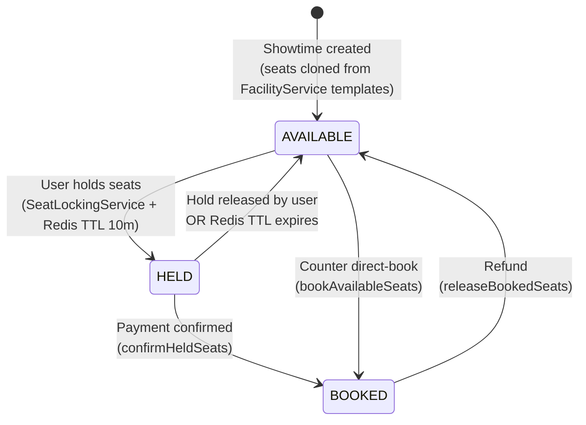
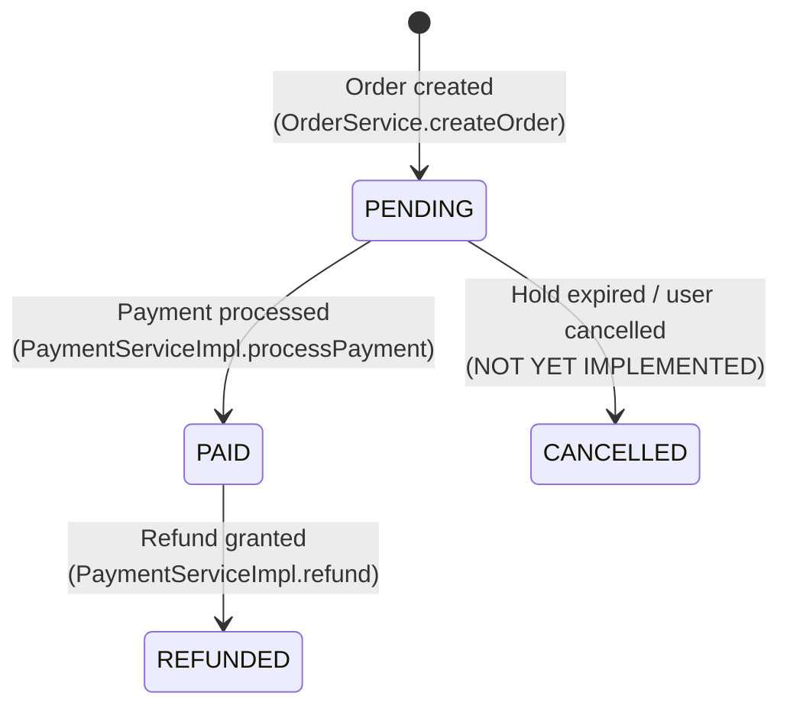
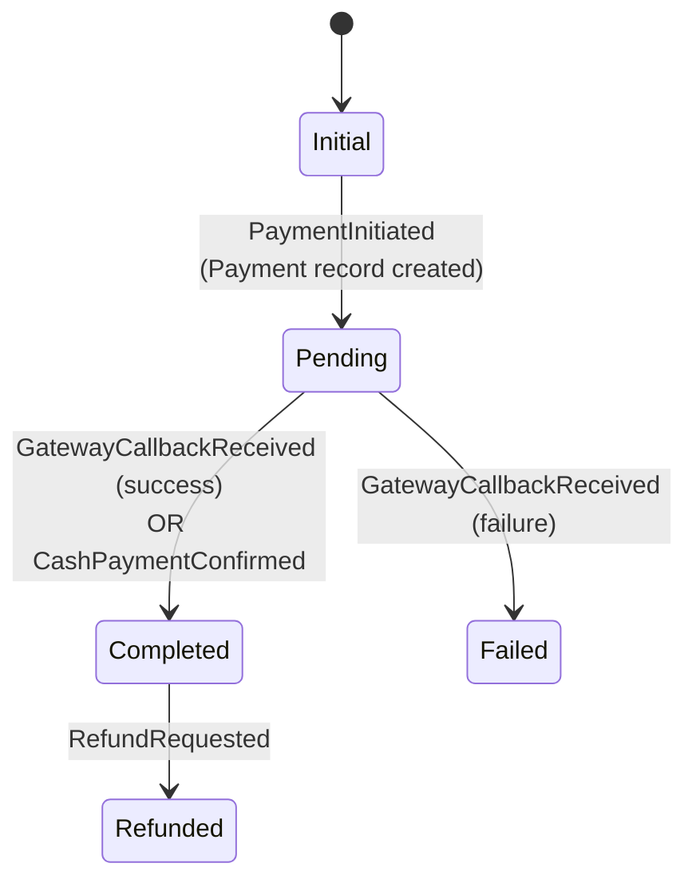
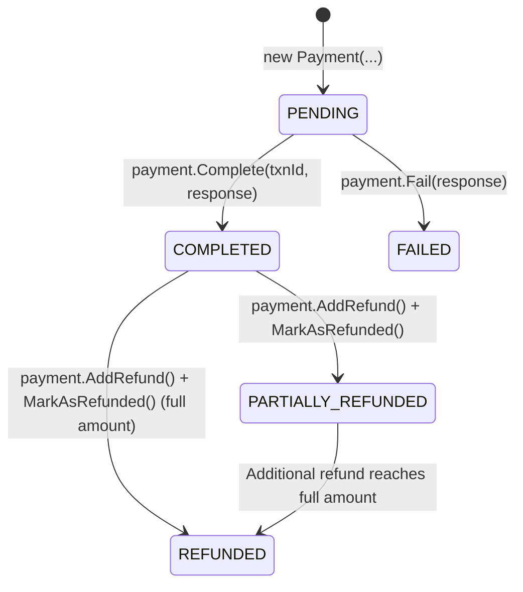
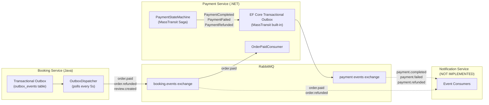

# Booking Flow — Saga & Service Interaction

> **Generated from source code analysis** — 2026-08-20
> Covers: Facility Service, Showtime Service, Booking Service, Payment Service, Notification Service (planned)

---

## 1. End-to-End Booking Sequence Diagram

```mermaid
sequenceDiagram
    participant User
    participant Gateway as API Gateway
    participant Showtime as Showtime Service<br/>(Java / Spring Boot)
    participant Facility as Facility Service<br/>(.NET / C#)
    participant Booking as Booking Service<br/>(Java / Spring Boot)
    participant Payment as Payment Service<br/>(.NET / C#)
    participant Notification as Notification Service<br/>(Not Implemented)
    participant Redis
    participant RabbitMQ as RabbitMQ / MassTransit

    Note over User, Notification: ── PHASE 1: Browse Showtimes ──

    User->>Gateway: GET /api/showtimes/movie/{movieId}
    Gateway->>Showtime: getShowtimesByMovie(movieId)
    Showtime->>Facility: GET /internal/facility/rooms/{roomId} (HTTP)
    Facility-->>Showtime: FacilityRoomView (roomName, cinemaName)
    Showtime-->>User: List<ShowtimeResponse>

    User->>Gateway: GET /api/showtimes/{id}/seats
    Gateway->>Showtime: getSeatMap(showtimeId)
    Showtime->>Facility: GET /internal/facility/seat-templates/{id} (HTTP)
    Facility-->>Showtime: FacilitySeatTemplateView (rowLabel, type, price multiplier)
    Showtime->>Redis: GET seat:hold:{showtimeId}:{seatId} (check TTL)
    Redis-->>Showtime: hold TTL or nil
    Showtime-->>User: List<ShowtimeSeatResponse> (status: available/holding/sold)

    Note over User, Notification: ── PHASE 2: Hold Seats (Temporary Lock) ──

    User->>Gateway: POST /api/showtimes/{id}/hold {seatIds}
    Gateway->>Showtime: SeatLockingService.holdSeats()
    Showtime->>Redis: SETNX seat:hold:{showtimeId}:{seatId} = userId (TTL 10 min)
    alt Seat available + Redis lock acquired
        Showtime->>Showtime: ShowtimeSeat.status = HELD (DB)
        Showtime-->>User: 200 OK "Seats held successfully"
    else Seat already held by another user
        Showtime-->>User: 409 SEAT_ALREADY_HELD
    end

    Note over User, Notification: ── PHASE 3: Create Order ──

    User->>Gateway: POST /api/orders {userId, showtimeId, seatIds, voucherCode?}
    Gateway->>Booking: OrderService.createOrder()
    Booking->>Showtime: POST /internal/showtimes/seats/validate-held (HTTP)
    Note right of Showtime: Validates: seats are HELD status<br/>+ Redis hold key owner matches userId<br/>Returns: totalAmount
    Showtime-->>Booking: SeatHoldValidationResult {seats, totalAmount}
    Booking->>Booking: Validate voucher (if provided)
    Booking->>Booking: Calculate discount & finalAmount
    Booking->>Booking: Save Order (status=PENDING)
    Booking-->>User: OrderResponse (id, status=PENDING, finalAmount)

    Note over User, Notification: ── PHASE 4A: Payment (Online — Stripe/PayPal) ──

    User->>Gateway: POST /api/payments/initiate {orderId, amount, method, cancelUrl, successUrl}
    Gateway->>Payment: InitiatePaymentCommand
    Payment->>Payment: Create Payment entity (status=PENDING, generates SagaId)
    Payment->>Payment: IPaymentGateway.InitiateAsync() → returns redirect URL
    Payment->>RabbitMQ: Publish PaymentInitiated {sagaId, paymentId, orderId}
    Note right of RabbitMQ: PaymentStateMachine:<br/>Initial → Pending
    Payment-->>User: PaymentInitiationResult {redirectUrl}
    User->>User: Redirected to Stripe/PayPal checkout

    Note over Payment, RabbitMQ: Gateway callback (webhook)
    User->>Gateway: POST /api/payments/callback/{method}
    Gateway->>Payment: HandlePaymentCallbackCommand
    Payment->>Payment: IPaymentGateway.VerifyCallbackAsync() (signature check)
    Payment->>RabbitMQ: Publish GatewayCallbackReceived {sagaId, isSuccess, txnId}

    alt Payment successful
        Note right of RabbitMQ: PaymentStateMachine:<br/>Pending → Completed
        RabbitMQ->>Payment: Saga calls payment.Complete(txnId)
        RabbitMQ->>RabbitMQ: Publishes PaymentCompleted {orderId, txnId, amount}
    else Payment failed
        Note right of RabbitMQ: PaymentStateMachine:<br/>Pending → Failed
        RabbitMQ->>Payment: Saga calls payment.Fail(reason)
        RabbitMQ->>RabbitMQ: Publishes PaymentFailed {orderId, reason}
    end

    Note over User, Notification: ── PHASE 4B: Payment (Cash — Counter) ──

    User->>Gateway: POST /api/payments/initiate {orderId, method=CASH}
    Gateway->>Payment: InitiatePaymentCommand (no gateway call)
    Payment->>RabbitMQ: Publish PaymentInitiated
    Note right of RabbitMQ: PaymentStateMachine:<br/>Initial → Pending
    Payment-->>User: PaymentInitiationResult {success, no redirect}

    Note over Payment: Staff collects cash at counter
    User->>Gateway: POST /api/payments/cash/confirm {paymentId, adminUserId}
    Gateway->>Payment: ConfirmCashPaymentCommand
    Payment->>RabbitMQ: Publish CashPaymentConfirmed {sagaId, paymentId}
    Note right of RabbitMQ: PaymentStateMachine:<br/>Pending → Completed
    RabbitMQ->>Payment: Saga calls payment.Complete("CASH-{id}-{timestamp}")
    RabbitMQ->>RabbitMQ: Publishes PaymentCompleted

    Note over User, Notification: ── PHASE 5: Confirm Seats & Generate Tickets ──
    Note over Booking: Currently triggered via direct HTTP call<br/>POST /api/orders/{id}/pay (not event-driven)

    User->>Gateway: POST /api/orders/{id}/pay {paymentMethod, transactionId}
    Gateway->>Booking: PaymentService.processPayment()
    Booking->>Showtime: POST /internal/showtimes/seats/confirm-held (HTTP)
    Note right of Showtime: Validates HELD status + Redis owner<br/>Transitions: ShowtimeSeat HELD → BOOKED<br/>Deletes Redis hold keys after commit
    Showtime-->>Booking: SeatBookingResult {seats, prices}
    Booking->>Booking: Generate Tickets (ticketCode=TK-UUID, QR data)
    Booking->>Booking: Order.status = PAID
    Booking->>RabbitMQ: Outbox → Publish order.paid {orderId, userId, showtimeId, ...}
    Booking-->>User: OrderResponse (status=PAID, tickets)

    Note over User, Notification: ── PHASE 6: Post-Payment Event Propagation ──

    RabbitMQ->>Payment: OrderPaidConsumer (logs only, no action)
    RabbitMQ--xNotification: order.paid → Send confirmation email/SMS (NOT IMPLEMENTED)
    RabbitMQ--xNotification: payment.completed → Send payment receipt (NOT IMPLEMENTED)

    Note over User, Notification: ── PHASE 7: Refund (Optional) ──

    User->>Gateway: POST /api/orders/{id}/refund {reason}
    Gateway->>Booking: PaymentService.refund()
    Booking->>Showtime: GET /internal/showtimes/{showtimeId}/schedule (HTTP)
    Booking->>Booking: Calculate refund % (>24h=100%, ≥4h=50%, <4h=denied)
    Booking->>Booking: Ticket.status = REFUNDED, Order.status = REFUNDED
    Booking->>Showtime: POST /internal/showtimes/seats/release-booked (HTTP)
    Note right of Showtime: ShowtimeSeat BOOKED → AVAILABLE
    Booking->>RabbitMQ: Outbox → Publish order.refunded
    Booking-->>User: OrderResponse (status=REFUNDED)
```



---

## 2. Services & Their Roles in the Booking Flow

### 2.1 Facility Service (.NET/C#) — Data Provider

| Aspect | Detail |
|--------|--------|
| **Role** | Provides room and seat template master data. Read-only participant in the booking flow. |
| **Technology** | .NET 9, MediatR, Clean Architecture |
| **Saga Participation** | **None** — stateless data provider, no saga state, no events published/consumed in the booking flow |
| **Key APIs consumed** | `GET /internal/facility/rooms/{roomId}` → `FacilityRoomView`<br/>`GET /internal/facility/seat-templates/{id}` → `FacilitySeatTemplateView`<br/>`GET /internal/facility/rooms/{roomId}/seat-templates` → `List<FacilitySeatTemplateView>` |
| **Called by** | Showtime Service (at showtime creation + seat map enrichment)<br/>Booking Service (seat map enrichment — room/seat display data) |

### 2.2 Showtime Service (Java/Spring Boot) — Seat Lifecycle Manager

| Aspect | Detail |
|--------|--------|
| **Role** | Manages showtimes, seat maps, temporary seat holds (Redis), and seat status transitions |
| **Technology** | Java 21, Spring Boot, JPA/PostgreSQL, Redis |
| **Saga Participation** | **None** — operates as a synchronous service called via internal HTTP APIs. No saga state machine, no event publishing/consuming in the booking flow. |
| **Seat State Machine** | `AVAILABLE` ↔ `HELD` → `BOOKED` → `AVAILABLE` (on refund) |
| **Hold Mechanism** | Redis `SETNX` with 10-minute TTL (`seat:hold:{showtimeId}:{seatId}` = userId) |
| **Key Internal APIs** | `POST /internal/showtimes/seats/validate-held` — Validate seats are HELD by correct user<br/>`POST /internal/showtimes/seats/confirm-held` — HELD → BOOKED<br/>`POST /internal/showtimes/seats/release-held` — HELD → AVAILABLE<br/>`POST /internal/showtimes/seats/release-booked` — BOOKED → AVAILABLE<br/>`POST /internal/showtimes/seats/validate-available` — Validate seats are AVAILABLE<br/>`POST /internal/showtimes/seats/book-available` — AVAILABLE → BOOKED (counter sales)<br/>`GET /internal/showtimes/{id}/schedule` — Get showtime schedule details |

**ShowtimeSeat Status Transitions:**



### 2.3 Booking Service (Java/Spring Boot) — Orchestrator

| Aspect | Detail |
|--------|--------|
| **Role** | Orchestrates the booking flow: creates orders, processes payments (locally), generates tickets, publishes outbox events |
| **Technology** | Java 21, Spring Boot, JPA/PostgreSQL, RabbitMQ (outbox pattern) |
| **Saga Participation** | **Transactional Outbox pattern** — not a state-machine saga, but uses transactional outbox to reliably publish events to RabbitMQ. Events are appended in the same DB transaction as the domain write, then dispatched by a background poller (`OutboxDispatcher`). |
| **Outbox Events Published** | `order.paid` → Exchange `booking.events`<br/>`order.refunded` → Exchange `booking.events`<br/>`review.created` → Exchange `booking.events` |

**Order Status Transitions:**



### 2.4 Payment Service (.NET/C#) — Saga State Machine

| Aspect | Detail |
|--------|--------|
| **Role** | Manages the payment lifecycle via a MassTransit State Machine Saga. Handles online payments (Stripe, PayPal) and cash payments. |
| **Technology** | .NET 9, MassTransit, MediatR, EF Core, PostgreSQL, RabbitMQ |
| **Saga Participation** | **YES — MassTransit `MassTransitStateMachine<PaymentSagaState>`** persisted in PostgreSQL (`payment_saga_states` table). Uses EF Core transactional outbox for reliable event dispatch. |

**Payment Saga State Machine:**



**Saga State Details:**

| State | Triggered By | Actions | Publishes |
|-------|-------------|---------|-----------|
| **Initial → Pending** | `PaymentInitiated` | Stores PaymentId, OrderId, UserId, Amount, Currency, PaymentMethod on saga state | — |
| **Pending → Completed** | `GatewayCallbackReceived` (isSuccess=true) | Calls `payment.Complete(txnId)` on domain entity, sets `CompletedAt` | `PaymentCompleted` (via outbox) |
| **Pending → Completed** | `CashPaymentConfirmed` | Generates `CASH-{id}-{timestamp}` txnId, calls `payment.Complete(...)` | `PaymentCompleted` (via outbox) |
| **Pending → Failed** | `GatewayCallbackReceived` (isSuccess=false) | Calls `payment.Fail(reason)` on domain entity, stores `FailureReason` | `PaymentFailed` (via outbox) |
| **Completed → Refunded** | `RefundRequested` | Calls `payment.AddRefund(amount, reason)` on domain entity | `PaymentRefunded` (via outbox) |

**Payment Domain Entity Status:**



### 2.5 Notification Service — NOT IMPLEMENTED

| Aspect | Detail |
|--------|--------|
| **Role** | Should consume integration events from RabbitMQ and send notifications (email, SMS, push) to users |
| **Current State** | Only a `refactor_plan.md` file exists. No code, no service skeleton. |
| **What it should do** | See Section 5 below |

---

## 3. Event Flow Map



---

## 4. Cross-Service Communication Summary

| From | To | Mechanism | When |
|------|----|-----------|------|
| Showtime Service | Facility Service | Synchronous HTTP (internal API) | Showtime creation (get room + seat templates), seat map enrichment |
| Booking Service | Showtime Service | Synchronous HTTP (`HttpSeatReservationService`) | Order creation (validate held seats), payment (confirm seats), refund (release seats) |
| Booking Service | Facility Service | Synchronous HTTP (`HttpFacilityReadService`) | Seat map display enrichment (row labels, seat types) |
| Booking Service | Payment Service | **Async via RabbitMQ** (outbox → `order.paid`) | After order is marked PAID |
| Payment Service | Booking Service | **Async via RabbitMQ** (`PaymentCompleted`, `PaymentFailed`) | After saga transitions — **but Booking Service does NOT consume these yet** |
| Booking / Payment | Notification Service | **Async via RabbitMQ** (not implemented) | Post-payment events |

---

## 5. What Needs to Be Done to Finish the Booking Flow

### 5.1 Critical — Flow Completion

| # | Gap | Detail | Services Affected |
|---|-----|--------|-------------------|
| 1 | **Booking Service does not consume `PaymentCompleted`/`PaymentFailed` events** | The Booking Service currently processes payment synchronously via `POST /api/orders/{id}/pay` (directly calls showtime confirm + generates tickets). It does NOT listen for the saga's `PaymentCompleted` event. The Payment Service publishes these events, but nobody in the Booking Service consumes them. The two flows (booking's direct HTTP-based payment, and payment service's saga) are **disconnected**. | Booking, Payment |
| 2 | **Dual payment path conflict** | Payment can be completed two ways: (a) `POST /api/orders/{id}/pay` directly on Booking Service, or (b) via the Payment Service saga. These paths are independent and there's no coordination. Need to decide on one canonical flow and remove/refactor the other. | Booking, Payment |
| 3 | **Order CANCELLED state never set** | `Order.OrderStatus` has `CANCELLED` but no code path sets it. When payment fails or hold expires, the order remains `PENDING` indefinitely. | Booking |
| 4 | **No automatic hold expiry handler** | Redis TTL handles Redis key expiry, but the DB `ShowtimeSeat.status` stays `HELD` after the Redis key expires. There is no background job or event listener that transitions stale HELD seats back to AVAILABLE in the database. | Showtime |
| 5 | **No timeout/expiry for PENDING orders** | If a user creates an order but never pays, the order stays PENDING and the held seats remain locked (until Redis TTL expires the hold key, but DB status isn't cleaned up). Need a scheduled cleanup job. | Booking, Showtime |

### 5.2 Important — Integration Gaps

| # | Gap | Detail | Services Affected |
|---|-----|--------|-------------------|
| 6 | **Notification Service not implemented** | Only a plan file exists. Should consume: `order.paid` → booking confirmation email, `payment.completed` → payment receipt, `order.refunded` → refund notification, `payment.failed` → payment failure notification. | Notification |
| 7 | **Payment Service `RefundRequested` not published by booking flow** | The Booking Service's `refund()` method refunds locally (releases seats, updates order/ticket status) but does NOT publish a `RefundRequested` event to trigger the Payment Service saga's refund transition. The two refund flows are disconnected. | Booking, Payment |
| 8 | **No compensating transactions for failure cases** | If seat confirmation fails after payment succeeds, there's no automatic rollback. If ticket generation fails mid-way, there's no cleanup. Need compensating saga steps. | Booking, Showtime, Payment |

### 5.3 Recommended — Architecture & UX

| # | Gap | Detail | Services Affected |
|---|-----|--------|-------------------|
| 9 | **Unify the payment flow** | Decide: either (a) the Booking Service becomes a saga participant that reacts to `PaymentCompleted` to confirm seats + generate tickets (event-driven), or (b) keep the synchronous flow but remove the Payment Service's saga `PaymentCompleted` → Booking integration since it's not used. | Booking, Payment |
| 10 | **QR code / PDF generation is stubbed** | `TicketGenerationServiceImpl` generates a placeholder QR string (`CINEMA|TK-XXX|SEAT:Y`). Real ZXing QR + iText/Flying Saucer PDF integration is not done yet. | Booking |
| 11 | **Voucher rollback on failed payment** | If payment fails after order creation, the voucher's `usedCount` is already incremented but never decremented. | Booking |
| 12 | **Counter sales flow incomplete** | `bookAvailableSeats()` exists in showtime service but is not wired into the order/payment flow for counter sales. | Booking, Showtime |

### 5.4 Notification Service — What It Should Do

The Notification Service should be an **event-driven consumer** that subscribes to integration events and dispatches notifications:

| Event | Source | Notification Action |
|-------|--------|-------------------|
| `order.paid` / `payment.completed` | Booking / Payment | Send booking confirmation email with ticket details, QR codes |
| `payment.failed` | Payment Service | Send payment failure notification with retry instructions |
| `order.refunded` / `payment.refunded` | Booking / Payment | Send refund confirmation email with refund amount and timeline |
| `review.created` | Booking Service | (Optional) Send review acknowledgment |

**Implementation approach:**
- Subscribe to `booking.events` and payment events exchanges via RabbitMQ
- Support multiple channels: email (SMTP/SendGrid), SMS (Twilio), push notifications
- Use templated messages with user/order/showtime context
- Include idempotency to prevent duplicate notifications
- Queue-based delivery with retry logic for transient failures

---

## 6. Outbox Pattern Details

### Booking Service (Java — Custom Outbox)

```
outbox_events table:
├── event_id (UUID)
├── event_type (routing key, e.g. "order.paid")
├── exchange_name ("booking.events")
├── routing_key
├── aggregate_type + aggregate_id
├── payload (JSON envelope)
├── status (PENDING → PUBLISHED / FAILED)
├── attempt_count + next_attempt_at
└── Polled by OutboxDispatcher every 5s with publisher-confirm
```

### Payment Service (.NET — MassTransit Built-in Outbox)

```
EF Core Transactional Outbox:
├── Integrated with MassTransit's InMemoryOutbox + EF Core
├── Events stored in same DB transaction as saga state changes
├── Dispatched automatically by MassTransit's outbox delivery service
└── Idempotent inbox for consumers (prevents reprocessing)
```

---

## 7. Technology Stack Summary

| Service | Language | Framework | DB | Messaging | Saga |
|---------|----------|-----------|-----|-----------|------|
| Facility Service | C# | .NET 9, MediatR | PostgreSQL | — | None |
| Showtime Service | Java 21 | Spring Boot | PostgreSQL + Redis | — | None |
| Booking Service | Java 21 | Spring Boot | PostgreSQL | RabbitMQ (custom outbox) | Transactional Outbox |
| Payment Service | C# | .NET 9, MassTransit, MediatR | PostgreSQL | RabbitMQ (MassTransit outbox) | MassTransit State Machine |
| Notification Service | TBD | TBD | TBD | RabbitMQ consumer | None |

---

## 8. Booking Service — Consuming Payment Service Events

> **Audience:** Booking Service developer (Java/Spring Boot).
> The Payment Service saga publishes events via MassTransit's EF Core outbox to RabbitMQ.
> The Booking Service must add RabbitMQ consumers to react to these events and complete the booking flow.

### 8.1 Events to Consume

| Event | Routing Key | When It's Published | What Booking Service Should Do |
|-------|------------|---------------------|-------------------------------|
| `PaymentCompleted` | `payment.completed` | Saga transitions Pending → Completed (online gateway success OR cash confirmed) | Confirm held seats → Generate tickets → Set Order status to `PAID` → Publish `order.paid` outbox event |
| `PaymentFailed` | `payment.failed` | Saga transitions Pending → Failed (gateway verification failed) | Release held seats → Set Order status to `CANCELLED` → (Optional) Rollback voucher `usedCount` |
| `PaymentRefunded` | `payment.refunded` | Saga transitions Completed → Refunded | Release booked seats → Set Tickets to `REFUNDED` → Set Order status to `REFUNDED` → Publish `order.refunded` outbox event |

### 8.2 Message JSON Structures

All messages are wrapped in an `EventEnvelope`. The JSON arriving on RabbitMQ looks like this:

#### `PaymentCompleted` (envelope)

```json
{
  "eventId": "a1b2c3d4-...",
  "eventType": "payment.completed",
  "occurredAt": "2026-08-20T12:00:00Z",
  "schemaVersion": 1,
  "source": "payment-service",
  "payload": {
    "correlationId": "d4e5f6a7-...",
    "paymentId": 42,
    "orderId": 101,
    "userId": 7,
    "amount": 350000.00,
    "transactionId": "txn_stripe_abc123",
    "paymentMethod": "STRIPE",
    "paidAt": "2026-08-20T12:00:00Z"
  }
}
```

**Java DTO (create in booking-service):**

```java
public record PaymentCompletedEvent(
    UUID correlationId,
    Long paymentId,
    Long orderId,
    Long userId,
    BigDecimal amount,
    String transactionId,
    String paymentMethod,
    LocalDateTime paidAt
) {}
```

---

#### `PaymentFailed` (envelope)

```json
{
  "eventId": "b2c3d4e5-...",
  "eventType": "payment.failed",
  "occurredAt": "2026-08-20T12:05:00Z",
  "schemaVersion": 1,
  "source": "payment-service",
  "payload": {
    "correlationId": "e5f6a7b8-...",
    "paymentId": 43,
    "orderId": 102,
    "userId": 8,
    "reason": "Card declined by issuer"
  }
}
```

**Java DTO:**

```java
public record PaymentFailedEvent(
    UUID correlationId,
    Long paymentId,
    Long orderId,
    Long userId,
    String reason
) {}
```

---

#### `PaymentRefunded` (envelope)

```json
{
  "eventId": "c3d4e5f6-...",
  "eventType": "payment.refunded",
  "occurredAt": "2026-08-20T13:00:00Z",
  "schemaVersion": 1,
  "source": "payment-service",
  "payload": {
    "correlationId": "f6a7b8c9-...",
    "paymentId": 42,
    "orderId": 101,
    "userId": 7,
    "refundAmount": 350000.00,
    "reason": "Customer requested refund"
  }
}
```

**Java DTO:**

```java
public record PaymentRefundedEvent(
    UUID correlationId,
    Long paymentId,
    Long orderId,
    Long userId,
    BigDecimal refundAmount,
    String reason
) {}
```

---

### 8.3 RabbitMQ Queue/Exchange Setup

The Payment Service (MassTransit) publishes to exchanges auto-created by MassTransit. The Booking Service needs to bind its own queues.

```yaml
# Add to booking-service application.yml

spring:
  rabbitmq:
    host: ${RABBITMQ_HOST:localhost}
    port: ${RABBITMQ_PORT:5672}

# Queue bindings (Spring AMQP @Bean or annotation-based)
payment-events:
  exchange: "PaymentService.Application.Contracts:EventEnvelope``1[[PaymentService.Application.IntegrationEvents:PaymentCompleted]]"
  # NOTE: MassTransit uses fully-qualified type names as exchange names.
  # Alternative: configure MassTransit in Payment Service to use simpler
  # exchange names like "payment.events" with custom topology.
```

> [!IMPORTANT]
> MassTransit auto-generates exchange names from the .NET message type's full name (e.g. `PaymentService.Application.Contracts:EventEnvelope\`1[[PaymentService.Application.IntegrationEvents:PaymentCompleted]]`). This is **not friendly for cross-language consumers**. Two options:
>
> **Option A (Recommended):** Configure MassTransit in Payment Service to use a custom `EntityNameFormatter` that maps to simple exchange names like `payment.events` with routing keys `payment.completed`, `payment.failed`, `payment.refunded`.
>
> **Option B:** Have the Booking Service bind to the MassTransit-generated exchange names directly (ugly but works).

### 8.4 Consumer Implementation (Spring AMQP)

Once exchange naming is resolved, the Booking Service consumers should look like:

```java
@Slf4j
@Component
@RequiredArgsConstructor
public class PaymentCompletedConsumer {

    private final OrderRepository orderRepository;
    private final SeatReservationService seatReservationService;
    private final TicketGenerationService ticketGenerationService;
    private final BookingOutboxEventWriter outboxEventWriter;

    @RabbitListener(queues = "booking.payment.completed")
    @Transactional
    public void handle(EventEnvelope<PaymentCompletedEvent> envelope) {
        PaymentCompletedEvent event = envelope.payload();
        log.info("PaymentCompleted received: orderId={}, txnId={}", event.orderId(), event.transactionId());

        Order order = orderRepository.findById(event.orderId()).orElse(null);
        if (order == null || order.getStatus() != Order.OrderStatus.PENDING) {
            log.warn("Order {} not found or not PENDING, skipping", event.orderId());
            return; // Idempotent: already processed or doesn't exist
        }

        // 1. Confirm held seats → BOOKED
        List<Long> seatIds = parseSeatIds(order.getSeatIdsSnapshot());
        SeatBookingResult result = seatReservationService.confirmHeldSeats(
            new SeatBookingRequest(order.getUserId(), order.getShowtimeId(), seatIds)
        );

        // 2. Generate tickets
        Map<Long, SeatView> seatsById = result.seats().stream()
            .collect(Collectors.toMap(SeatView::seatId, Function.identity()));
        for (Long seatId : seatIds) {
            SeatView seat = seatsById.get(seatId);
            Ticket ticket = Ticket.builder()
                .order(order)
                .showtimeSeatId(seatId)
                .price(seat != null ? seat.price() : BigDecimal.ZERO)
                .status(Ticket.TicketStatus.VALID)
                .build();
            ticketGenerationService.generateTicket(ticket);
        }

        // 3. Update order
        order.setPaymentMethod(event.paymentMethod());
        order.setPaymentTransactionId(event.transactionId());
        order.setStatus(Order.OrderStatus.PAID);
        orderRepository.save(order);

        // 4. Publish order.paid outbox event
        ShowtimeScheduleView showtime = seatReservationService.getSchedule(order.getShowtimeId());
        outboxEventWriter.orderPaid(order, showtime, seatIds.size());

        log.info("Order {} completed via PaymentCompleted event", order.getId());
    }
}
```

```java
@Slf4j
@Component
@RequiredArgsConstructor
public class PaymentFailedConsumer {

    private final OrderRepository orderRepository;
    private final SeatReservationService seatReservationService;

    @RabbitListener(queues = "booking.payment.failed")
    @Transactional
    public void handle(EventEnvelope<PaymentFailedEvent> envelope) {
        PaymentFailedEvent event = envelope.payload();
        log.warn("PaymentFailed received: orderId={}, reason={}", event.orderId(), event.reason());

        Order order = orderRepository.findById(event.orderId()).orElse(null);
        if (order == null || order.getStatus() != Order.OrderStatus.PENDING) {
            return; // Idempotent
        }

        // 1. Release held seats → AVAILABLE
        List<Long> seatIds = parseSeatIds(order.getSeatIdsSnapshot());
        seatReservationService.releaseHeldSeats(
            new SeatBookingRequest(order.getUserId(), order.getShowtimeId(), seatIds)
        );

        // 2. Cancel order
        order.setStatus(Order.OrderStatus.CANCELLED);
        orderRepository.save(order);

        log.info("Order {} cancelled due to payment failure", order.getId());
    }
}
```

### 8.5 What to Remove After Migration

Once the event-driven consumers above are working:

1. **Remove or restrict** `POST /api/orders/{id}/pay` — this endpoint bypasses the Payment Service entirely. Either:
   - Delete it, or
   - Keep it as an admin-only fallback for edge cases
2. **Remove** the direct seat-confirmation logic from `PaymentServiceImpl.processPayment()` — it's now handled by `PaymentCompletedConsumer`
3. The `POST /api/orders/{id}/refund` endpoint can remain as-is if you want user-initiated refunds, but it should also publish `RefundRequested` to the Payment Service saga so the payment record stays in sync

### 8.6 Shared EventEnvelope DTO (Java side)

Create this in the booking-service `dto` or `messaging` package to deserialize the Payment Service's envelope:

```java
public record EventEnvelope<T>(
    UUID eventId,
    String eventType,
    Instant occurredAt,
    int schemaVersion,
    String source,
    T payload
) {}
```

> [!TIP]
> Use Jackson's `@JsonTypeInfo` or a custom `MessageConverter` to handle generic deserialization of `EventEnvelope<PaymentCompletedEvent>` vs `EventEnvelope<PaymentFailedEvent>` based on the `eventType` field.
