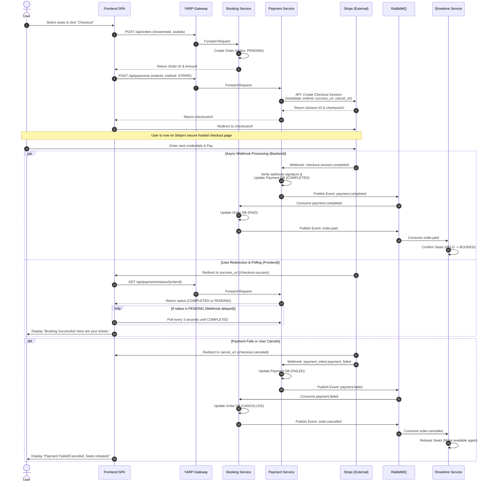

# Payment Gateway Integration Flow

Integrating a real payment gateway like Stripe in a microservices architecture involves coordinating the frontend, multiple backend services, the external payment provider, and asynchronous messaging (RabbitMQ).

Here is a comprehensive visualization of the booking flow, from seat selection to payment success, including async webhook processing and failure fallbacks.

## Key Concepts in this Flow

> [!IMPORTANT]  
> **Never trust the Frontend for payment status!** 
> The redirection to the `success_url` (Step 13) does **not** mean the payment is guaranteed in your system yet. You must always rely on the secure backend-to-backend Webhook (Step 14) from Stripe to actually fulfill the order and generate tickets.

1. **Hosted Checkout vs API**: By using Stripe Checkout Sessions, the frontend redirects the user to Stripe's own secure page. This greatly reduces your PCI compliance burden because card details never touch your Frontend or Backend.
2. **Asynchronous Webhooks**: When payment succeeds, Stripe sends an HTTP POST (webhook) to your Payment Service. Since this happens asynchronously over the internet, it might arrive a few seconds *after* the user is redirected back to your frontend.
3. **Frontend Polling Fallback**: Because of the potential webhook delay, when the user lands on `/checkout-success`, the frontend should display a loading spinner ("Confirming your payment...") and poll the Payment Service every few seconds until the status changes from `PENDING` to `COMPLETED`.
4. **Saga Choreography via RabbitMQ**: The Payment Service doesn't talk directly to the Booking Service. It just broadcasts `payment.completed` to RabbitMQ. The Booking Service listens to this, marks the order paid, and then broadcasts `order.paid`. The Showtime Service listens to *that* to finalize the seat locks.
5. **Failure Fallbacks**: If the user clicks "Back" on the Stripe page, or the card declines, Stripe redirects them to the `cancel_url`. Concurrently, Stripe fires a failure webhook. The saga runs in reverse (compensating actions): marking payment failed, cancelling the order, and releasing the locked seats.
